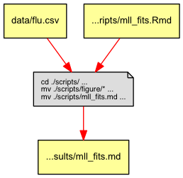
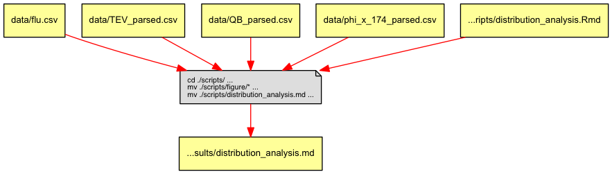
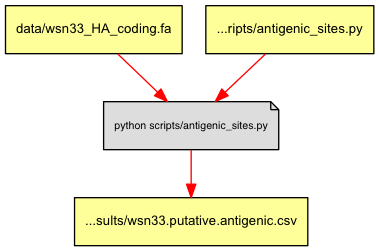
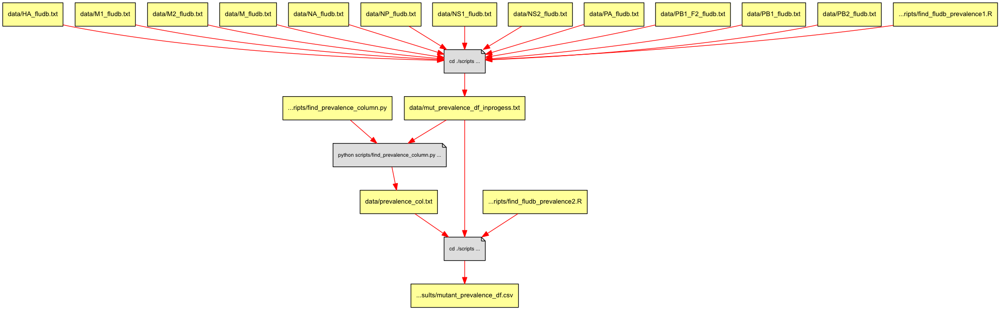

#Overview
```
project
	|- README          	# the top level description of content
	|
	|- data            	# raw and primary data, are not changed once created
	|- scripts       	# any programmatic code
	|- results         	# all output from workflows and analyses
	+- Makefile        	# executable Makefile for this study
    
```


Each of the analyses done in the publication can be rerun using the steps in the provided Makefile. For each analysis we will provide the 'make' command that will complete the analysis as well as a figure highlighting what files are used for the analysis. More details regarding what each script does can be found as comments either in the script or in the resulting markdown document.

## Fitting the data with maximum likelihood

```
make results/mll_fits.md
```


## Analyzing the MFE distributions

```
make results/distribution_analysis.md 
```


## Antigenic analysis

```
make ./results/wsn33.putative.antigenic.csv
```


We then took these putative antigenic sites and compared them to similar alignments of the antigenic sites discussed in Xu et. al. These mappings can be found in xu_bloom_antigenic.sites.txt. Addintionally these sites were varified by hand. This work can be found in results/anitgenic_by_hand.rtf.The results from this work can be found in wsn33.antigenic.csv

## Analysis of the prevalence of the Flu mutations in Fludb

```
make results/mutant_prevalence_df.csv
```

