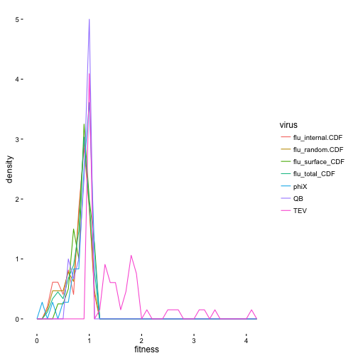

This is an R Markdown document for the MFE distribution analysis.

##### load in packages for analysis

```r
# LOAD PACKAGES
library(moments)
library(nortest)
library(lattice)
library(qpcR)
```

```
## Loading required package: MASS
```

```
## Loading required package: minpack.lm
```

```
## Loading required package: rgl
```

```
## Loading required package: robustbase
```

```
## Warning: package 'robustbase' was built under R version 3.2.5
```

```
## Loading required package: Matrix
```

```r
library(plyr)
library(ggplot2)
```

```
## Warning: package 'ggplot2' was built under R version 3.2.4
```

```r
library(tidyr)
```

```
## 
## Attaching package: 'tidyr'
```

```
## The following object is masked from 'package:Matrix':
## 
##     expand
```

##### read in the parsed data files as dataframes


```r
# READ IN FITNESS DATA FOR EACH VIRUS
  
  #polio
    #already represented as fitness
  # polio_fitness_df<-read.csv("~/Desktop/scripts/data/AshleyFig4.csv")
  # polio_fitness_df$virus <-"polio"
  # polio_fitness_df$fitness <-polio_fitness_df$Fitness

  #these viruses are in therms of S so need to add 1
  #TEV
  TEV_fitness_df<-read.csv("../data/TEV_parsed.csv")
  TEV_fitness_df$s<-sub("\\(.*$","",TEV_fitness_df$Relative.fitness) #add column for fitness
  TEV_fitness_df$fitness<-(as.numeric(TEV_fitness_df$s))+1
  TEV_fitness_df$virus<-"TEV"
  
  #QB 
  QB_fitness_df<-read.csv("../data/QB_parsed.csv")
  QB_fitness_df$virus <- "QB"
  QB_fitness_df$fitness<-1+(QB_fitness_df$relative_fitness)

  #phiX174 
  phiX174_fitness_df<-read.csv("../data/phi_x_174_parsed.csv")
  phiX174_fitness_df$virus<-"phix174"
  phiX174_fitness_df$fitness<-1+(phiX174_fitness_df$relative_fitness)

  # Flu 
    #there are 6 datasets here
    # +/- lethal fraction for:
      #1. All
      #2. HA + NA
      #3  External segments
  flu_fitness_df<- read.csv("../data/flu.csv")
```
#####Examine Skew and Kurtosis in non-lethal fraction

```r
  #shorter variable names and remove lethal fractions
    phiX<-phiX174_fitness_df$fitness
    names(phiX)<-c(rep("phiX",length(phiX))) #name the vector
      phiX.CDF<-phiX[phiX!=0]
      
    QB<-QB_fitness_df$fitness
    names(QB)<-c(rep("QB",length(QB)))
      QB.CDF<-QB[QB!=0]

    TEV<-TEV_fitness_df$fitness
    names(TEV)<-c(rep("TEV",length(TEV)))
      TEV.CDF<-TEV[TEV!=0]

    # polio<-polio_fitness_df$fitness
    # names(polio)<-c(rep("polio",length(polio)))
    #   polio.CDF<-polio[polio!=0]

    # Without lethal fractions
    flu_total.CDF<-flu_fitness_df$Total.CDF #all
    flu_total.CDF<-subset(flu_total.CDF, flu_total.CDF > -10) # remove NAs by subsetting w/small #
    names(flu_total.CDF)<-c(rep("flu_total_CDF",length(flu_total.CDF)))

    flu_random.CDF<-flu_fitness_df$Random.CDF #this is all w/o lethal
    flu_random.CDF<-subset(flu_random.CDF, flu_random.CDF > -10)
    names(flu_random.CDF)<-c(rep("flu_random.CDF",length(flu_random.CDF)))

    flu_surface.CDF<-flu_fitness_df$Surface.CDF #HA + NA
    flu_surface.CDF<-subset(flu_surface.CDF, flu_surface.CDF > -10)
    names(flu_surface.CDF)<-c(rep("flu_surface_CDF",length(flu_surface.CDF)))

    flu_internal.CDF<-flu_fitness_df$Internal.CDF #internal
    flu_internal.CDF<-subset(flu_internal.CDF, flu_internal.CDF > -10)
    names(flu_internal.CDF)<-c(rep("flu_internal.CDF",length(flu_internal.CDF)))


# EXAMINE SKEWNESS
  skewness(phiX.CDF)
```

```
## [1] -1.873701
```

```r
  skewness(QB.CDF)
```

```
## [1] -1.110005
```

```r
  skewness(TEV.CDF)
```

```
## [1] 1.815592
```

```r
  #skewness(polio.CDF)
  skewness(flu_total.CDF)
```

```
## [1] -1.154976
```

```r
  skewness(flu_random.CDF)
```

```
## [1] -1.119408
```

```r
  skewness(flu_surface.CDF)
```

```
## [1] -0.8492888
```

```r
  skewness(flu_internal.CDF)
```

```
## [1] -0.985991
```

```r
# EXAMINE KURTOSIS
  kurtosis(phiX.CDF)
```

```
## [1] 6.321138
```

```r
  kurtosis(QB.CDF)
```

```
## [1] 3.011725
```

```r
  kurtosis(TEV.CDF)
```

```
## [1] 6.51863
```

```r
  #kurtosis(polio.CDF)
  kurtosis(flu_total.CDF)
```

```
## [1] 3.870024
```

```r
  kurtosis(flu_random.CDF)
```

```
## [1] 3.480084
```

```r
  kurtosis(flu_surface.CDF)
```

```
## [1] 3.743653
```

```r
  kurtosis(flu_internal.CDF)
```

```
## [1] 2.981663
```

```r
# MEAN
  mean(phiX.CDF)
```

```
## [1] 0.8739444
```

```r
  mean(QB.CDF)
```

```
## [1] 0.8972333
```

```r
  mean(TEV.CDF)
```

```
## [1] 1.513197
```

```r
  #mean(polio.CDF)
  mean(flu_total.CDF)
```

```
## [1] 0.8248315
```

```r
  mean(flu_random.CDF)
```

```
## [1] 0.7978125
```

```r
  mean(flu_surface.CDF)
```

```
## [1] 0.87925
```

```r
  mean(flu_internal.CDF)
```

```
## [1] 0.7804082
```

```r
#variance
    #flu
  var(flu_total.CDF)
```

```
## [1] 0.04419344
```

```r
  var(flu_random.CDF)
```

```
## [1] 0.0478872
```

```r
  var(flu_surface.CDF)
```

```
## [1] 0.02576609
```

```r
  var(flu_internal.CDF)
```

```
## [1] 0.055604
```

```r
    #polio
  #var(polio.CDF)
  


#t-tests for mean fitness for flu only
#surface vs internal is the only one that makes sense and is legit to to do since all others are subsets of each other, so they represent the same samples.
t.test(flu_surface.CDF, flu_internal.CDF)
```

```
## 
## 	Welch Two Sample t-test
## 
## data:  flu_surface.CDF and flu_internal.CDF
## t = 2.3435, df = 84.464, p-value = 0.02145
## alternative hypothesis: true difference in means is not equal to 0
## 95 percent confidence interval:
##  0.01497431 0.18270936
## sample estimates:
## mean of x mean of y 
## 0.8792500 0.7804082
```

```r
#INTERNAL AND SURFACE DO NOT HAVE THE SAME MEAN FITNESS.
```

##### Histograms


```r
#make df with all of the CDF fitness

Big_fitness_df<-as.data.frame(c(phiX.CDF, QB.CDF,TEV.CDF, flu_total.CDF, flu_random.CDF, flu_surface.CDF, flu_internal.CDF))#, polio.CDF))
colnames(Big_fitness_df)<-"fitness"
Big_fitness_df$virus<-names(c(phiX.CDF, QB.CDF,TEV.CDF, flu_total.CDF, flu_random.CDF, flu_surface.CDF, flu_internal.CDF))#, polio.CDF))

#double check that these are only the non-lethals
sum(Big_fitness_df$fitness > -1)
```

```
## [1] 374
```

```r
length(Big_fitness_df$fitness)
```

```
## [1] 374
```

```r
  #yup! they are

#MAKE HISTOGRAM that we don't need but it is pretty
all_hist<-(ggplot(Big_fitness_df, aes(fitness, ..density.., colour = virus)) +
  geom_freqpoly(binwidth = .1)+
  theme_classic())
plot(all_hist)
```



