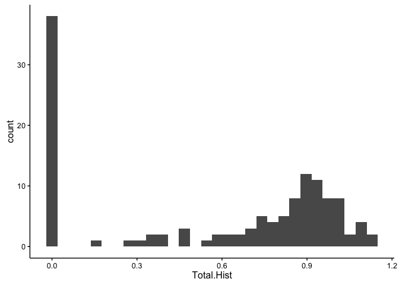
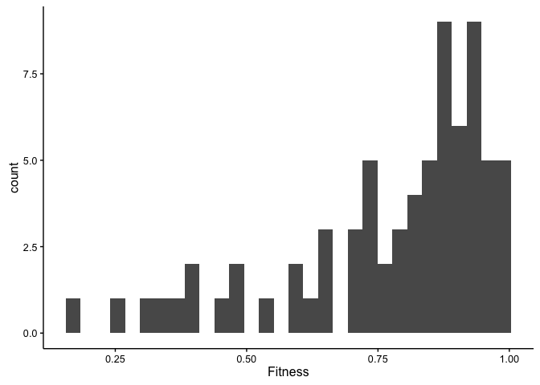
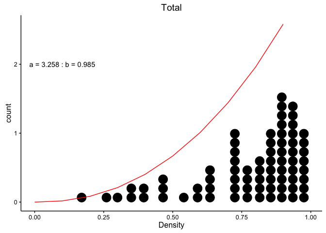
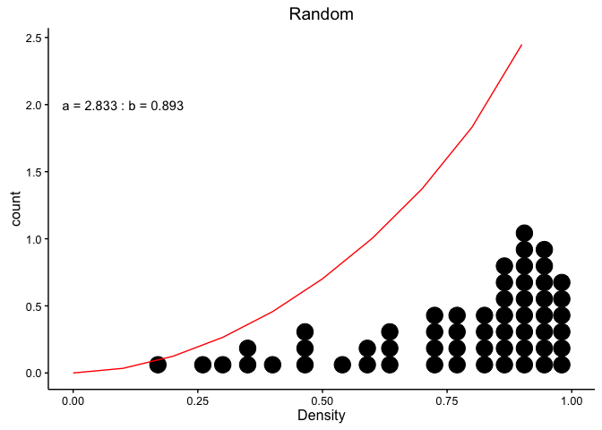
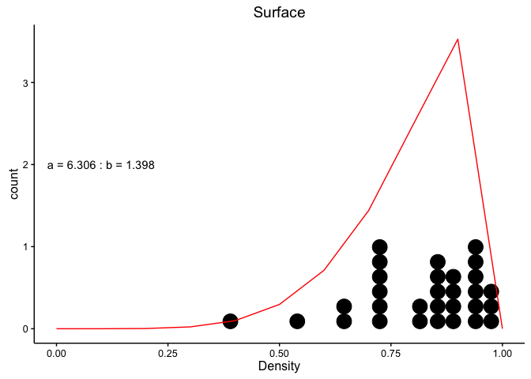
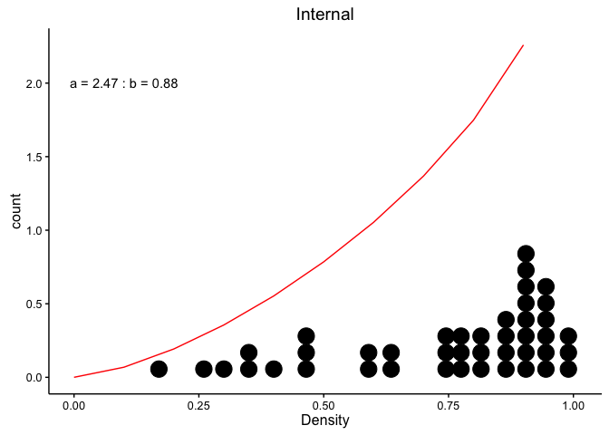
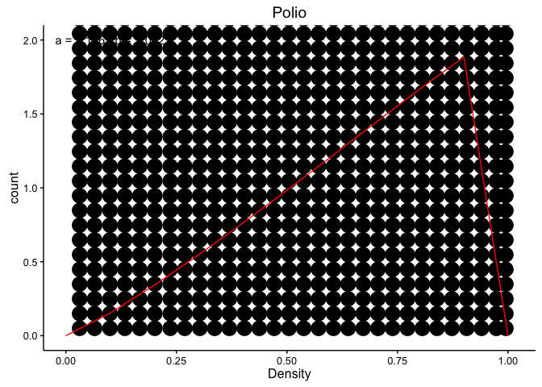

MFE distributions Maximum likelihood
================
JT McCrone
April 22, 2016

-   [functions](#functions)
-   [Flu MFE Table](#flu-mfe-table)
    -   [Adding uniform distributions](#adding-uniform-distributions)
-   [Polio MFE data](#polio-mfe-data)
-   [Beta parameters](#beta-parameters)
    -   [Checking the fit](#checking-the-fit)

In this document we'll try to fit the distribution of the MFE using maximum likelihood methods and the r package bbmle. We'll also rely on Rs built in distributions and for the time being we'll be using the data in Ashley *et. al* until the influenza data is ready.

``` r
data.df <- read.csv("../data/flu.csv", stringsAsFactors = F)

ggplot(data.df, aes(x = Total.Hist)) + geom_histogram()
```

    ## `stat_bin()` using `bins = 30`. Pick better value with `binwidth`.



To start we'll use the models from Sanjuan 2004 and to make things even easier we'll just look at the simple noncompounded models first and save the compounded ones for later. If I understand the paper correctly they just model the distribution of the negative effects (&lt;1.0 , not necessarily significant) that are not lethal. We could model the lethal effects with a zero-inflated model, but we'll save that for later.

I'll subset the data above to include the non-lethal negative fitnesses

``` r
model.df <- mutate(data.df, Fitness = Total.CDF)  # change this to other columns if you'd like to model those as well.
model.df <- subset(model.df, Fitness > 0 & Fitness < 1)
ggplot(model.df, aes(x = Fitness)) + geom_histogram()
```

    ## `stat_bin()` using `bins = 30`. Pick better value with `binwidth`.



### functions

For some reason these need to be nested into a function that renames the input data as fitness. I think it has to do with the way I'm passing data to mle2

``` r
gammaNLL <- function(shape, scale, data) {
    # gamma negative log likelihood
    -sum(dgamma(data, shape = shape, scale = scale, log = T))  # the negative of the sum of the prob of seeing the data give the shape and scale parameters. Log transform the probabilities
}

gamma_fit <- function(fitness) {
    m = mean(fitness)
    vm = var(fitness)/mean(fitness)
    
    gammamodel <- mle2(gammaNLL, start = list(shape = m/vm, scale = vm), data = list(data = fitness))
    gammamodel
    AIC(gammamodel, k = 2)
}


betaNLL <- function(a, b, data) {
    # print(data)
    -sum(dbeta(data, shape1 = a, shape2 = b, log = T))
}

beta_fit <- function(fitness, params = F) {
    # data<-fitness print(data)
    betamodel <- mle2(betaNLL, start = list(a = 5, b = 5), data = list(data = fitness))  # start with 5 for a and b which visually matches the data. I have tried a number of starting points and this analysis is robust we get the same output each time. 
    
    x <- AIC(betamodel, k = 2)
    if (params == T) {
        x <- data.frame(shape1 = round(betamodel@coef[1], 3), shape2 = round(betamodel@coef[2], 
            3))
        conf <- confint(betamodel)
        x <- mutate(x, shape1 = paste0(shape1, " (", round(conf[1, 1], 3), "-", 
            round(conf[1, 2], 3), ")"), shape2 = paste0(shape2, " (", round(conf[2, 
            1], 3), "-", round(conf[2, 2], 3), ")"))
    }
    return(x)
}
# plot(profile(betamodel))


WeibullNLL <- function(a, b, data) {
    -sum(dweibull(data, shape = a, scale = b, log = T))
    
}

weibull_fit <- function(fitness) {
    weibullmodel <- mle2(WeibullNLL, start = list(a = 5, b = 5), data = list(data = fitness))  # start with 5 for a and b which visually matches the data.
    weibullmodel
    AIC(weibullmodel, k = 2)
}


lognormalNLL <- function(a, b, data) {
    -sum(dlnorm(data, meanlog = a, sdlog = b, log = T))
    
}

lnorm_fit <- function(fitness) {
    lnormmodel <- mle2(lognormalNLL, start = list(a = mean(log(fitness)), b = sd(log(fitness))), 
        data = list(data = fitness))
    lnormmodel
    AIC(lnormmodel, k = 2)
}


expNLL <- function(a, data) {
    -sum(dexp(data, rate = a, log = T))
}

exp_fit <- function(fitness) {
    expmodel <- mle2(expNLL, start = list(a = 1/mean(fitness)), data = list(data = fitness))
    expmodel
    AIC(expmodel, k = 1)
}
```

Flu MFE Table
=============

``` r
make_table <- function(data) {
    fitness <- data[which(data < 1)]
    x <- data.frame(Distribution = c("Exponential", "Gamma", "Beta", "Weibull", 
        "Lognormal"), AIC = c(exp_fit(fitness), gamma_fit(fitness), beta_fit(fitness), 
        weibull_fit(fitness), lnorm_fit(fitness)))
}

total <- make_table(data.df$Total.CDF)

random <- make_table(data.df$Random.CDF)
surface <- make_table(data.df$Surface.CDF)
internal <- make_table(data.df$Internal.CDF)


all_table <- data.frame(Distribution = c("Exponential", "Gamma", "Beta", "Weibull", 
    "Lognormal"), Total = total$AIC, Random = random$AIC, Surface = surface$AIC, 
    Internal = internal$AIC)

knitr::kable(all_table)
```

| Distribution |       Total|      Random|    Surface|    Internal|
|:-------------|-----------:|-----------:|----------:|-----------:|
| Exponential  |  109.824436|   84.814139|   49.11733|   61.536311|
| Gamma        |   -2.633794|    5.372353|  -23.98510|    9.755840|
| Beta         |  -68.630982|  -48.693444|  -42.91293|  -28.713227|
| Weibull      |  -33.906937|  -17.061899|  -35.77080|   -4.538429|
| Lognormal    |   12.427892|   17.069145|  -21.11320|   18.078600|

Adding uniform distributions
----------------------------

In this analyis we add a uniform distribution. We ARE NOT letting the parameters vary but rather are letting a proportion of the variants fall on a uniform distribution between 0 and some parameter b.

### Exponential + uniform

``` r
expUniNLL <- function(a, p, m) {
    expll <- p * dexp(model.df$Fitness, rate = a)
    unill <- (1 - p) * dunif(model.df$Fitness, 0, m)
    likeli <- sum(expll, unill, na.rm = T)
    LL = -sum(log(likeli))
    
    # print(c(a,p,m)) print(LL)
    
    if (is.finite(LL)) 
        return(LL) else return(1000)
}

expUnimodel <- mle2(expUniNLL, start = list(a = 1/mean(model.df$Fitness), p = 0.5, 
    m = 0.5), method = "L-BFGS-B", lower = c(0, 0, 0), upper = c(100, 1, 1))
expUnimodel
```

    ## 
    ## Call:
    ## mle2(minuslogl = expUniNLL, start = list(a = 1/mean(model.df$Fitness), 
    ##     p = 0.5, m = 0.5), method = "L-BFGS-B", lower = c(0, 0, 0), 
    ##     upper = c(100, 1, 1))
    ## 
    ## Coefficients:
    ##       a       p       m 
    ## 1.40819 1.00000 0.00000 
    ## 
    ## Log-likelihood: 3.58

``` r
AIC(expUnimodel, k = 3)
```

    ## [1] 1.830822

### Gamma + uniform

``` r
gammaUniNLL <- function(a, b, p, m) {
    # gamma negative log likelihood
    gammall <- p * dgamma(model.df$Fitness, shape = a, scale = b)
    unill <- (1 - p) * dunif(model.df$Fitness, 0, m)
    likeli <- sum(gammall, unill, na.rm = T)
    LL = -sum(log(likeli))
    # LL<-sum(log(p*dgamma(model.df$Fitness,shape=a,scale=b)+(1-p)*dunif(model.df$Fitness,0,m)))
    # # the negative of the sum of the prob of seeing the data give the shape
    # and scale parameters. Log transform the probabilities print(c(a,b,p,m))
    # print(LL)
    
    if (is.finite(LL)) 
        return(LL) else return(1000)
}

m = mean(model.df$Fitness)
vm = var(model.df$Fitness)/mean(model.df$Fitness)

gammaUniModel <- mle2(gammaUniNLL, start = list(a = m/vm, b = vm, p = 0.5, m = 0.5), 
    method = "L-BFGS-B", lower = list(p = 0, m = 0), upper = list(p = 1, m = 1))
gammaUniModel
```

    ## 
    ## Call:
    ## mle2(minuslogl = gammaUniNLL, start = list(a = m/vm, b = vm, 
    ##     p = 0.5, m = 0.5), method = "L-BFGS-B", lower = list(p = 0, 
    ##     m = 0), upper = list(p = 1, m = 1))
    ## 
    ## Coefficients:
    ##         a         b         p         m 
    ## 1.0000000 0.7101327 1.0000000 0.0000000 
    ## 
    ## Log-likelihood: 3.58

``` r
AIC(gammaUniModel, k = 4)
```

    ## [1] 8.830822

The extra distributions aren't really adding anything.

Polio MFE data
==============

This is fitting the polio fitness data. I have selected for fitness values between 0 and 1.

``` r
polio <- read.csv("../data/AshleyFig4.csv")
polio <- subset(polio, Fitness > 0 & Fitness < 1)

polio.tb <- make_table(polio$Fitness)

knitr::kable(polio.tb)
```

| Distribution |         AIC|
|:-------------|-----------:|
| Exponential  |   6970.5079|
| Gamma        |   1338.4441|
| Beta         |  -2519.1795|
| Weibull      |   -499.8882|
| Lognormal    |   3174.4454|

Beta parameters
===============

I haven't done anything with significant digits yet

``` r
make_params_table <- function(data) {
    fitness <- data[which(data < 1)]
    fit <- beta_fit(fitness, params = T)
    t(fit)
}

total.p <- make_params_table(data.df$Total.CDF)

random.p <- make_params_table(data.df$Random.CDF)
surface.p <- make_params_table(data.df$Surface.CDF)
internal.p <- make_params_table(data.df$Internal.CDF)
polio.p <- make_params_table(polio$Fitness)

all_table <- data.frame(Total = total.p, Random = random.p, Surface = surface.p, 
    Internal = internal.p, Polio = polio.p)
names(all_table) <- c("Total", "Random", "Surface", "Internal", "Polio")

knitr::kable(all_table, padding = 0)
```

|        | Total               | Random              | Surface              | Internal           | Polio               |
|--------|:--------------------|:--------------------|:---------------------|:-------------------|:--------------------|
| shape1 | 3.258 (2.277-4.487) | 2.833 (1.882-4.062) | 6.306 (3.531-10.216) | 2.47 (1.544-3.715) | 2.166 (2.086-2.247) |
| shape2 | 0.985 (0.731-1.297) | 0.893 (0.638-1.216) | 1.398 (0.857-2.151)  | 0.88 (0.595-1.252) | 1.022 (0.989-1.056) |

Checking the fit
----------------

``` r
check_fit <- function(data, title) {
    fitness <- data[which(data < 1)]
    fit <- beta_fit(fitness, params = T)
    a = as.numeric(strsplit(fit$shape1, " ")[[1]][1])
    b = as.numeric(strsplit(fit$shape2, " ")[[1]][1])
    x = seq(0, 1, 0.1)
    model = data.frame(Fitness = x, Density = dbeta(x, a, b))
    exp = data.frame(Fitness = fitness)
    ggplot(exp, aes(x = Fitness)) + geom_dotplot() + geom_line(data = subset(model, 
        is.finite(Density)), aes(x = Fitness, y = Density), color = "red") + 
        xlab("Density") + ggtitle(title) + annotate("text", x = 0.1, y = 2, 
        label = paste0("a = ", as.character(a), " : ", "b = ", as.character(b)))
}

check_fit(data.df$Total.CDF, "Total")
```

    ## `stat_bindot()` using `bins = 30`. Pick better value with `binwidth`.



``` r
check_fit(data.df$Random.CDF, "Random")
```

    ## `stat_bindot()` using `bins = 30`. Pick better value with `binwidth`.



``` r
check_fit(data.df$Surface.CDF, "Surface")
```

    ## `stat_bindot()` using `bins = 30`. Pick better value with `binwidth`.



``` r
check_fit(data.df$Internal.CDF, "Internal")
```

    ## `stat_bindot()` using `bins = 30`. Pick better value with `binwidth`.



``` r
check_fit(polio$Fitness, "Polio")
```

    ## `stat_bindot()` using `bins = 30`. Pick better value with `binwidth`.


