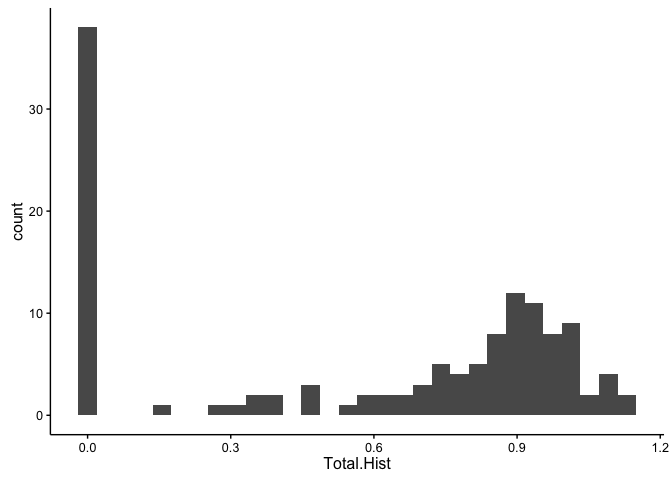
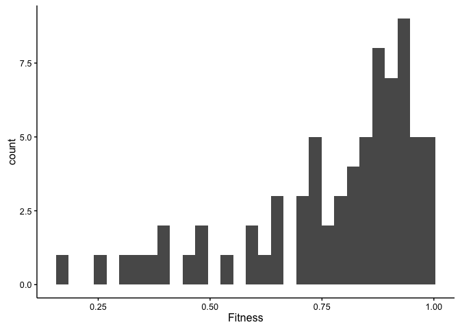

# MFE distributions Maximum likelihood
JT McCrone  
April 22, 2016  


In this document we'll try to fit the distribution of the MFE using maximum likelihood methods and the r package bbmle. We'll also rely on Rs built in distributions and for the time being we'll be using the data in Ashley _et. al_ until the influenza data is ready.


```r
data.df<-read.csv("../data/flu.csv",stringsAsFactors = F)

ggplot(data.df,aes(x=Total.Hist))+geom_histogram()
```

```
## `stat_bin()` using `bins = 30`. Pick better value with `binwidth`.
```

```
## Warning: Removed 1 rows containing non-finite values (stat_bin).
```



To start we'll use the models from Sanjuan 2004 and to make things even easier we'll just look at the simple noncompounded models first and save the compounded ones for later. If I understand the paper correctly they just model the distribution of the negative effects (<1.0 , not necessarily significant) that are not lethal. We could model the lethal effects with a zero-inflated model, but we'll save that for later.

I'll subset the data above to include the non-lethal negative fitnesses

```r
model.df<-mutate(data.df,Fitness=Total.CDF) # change this to other columns if you'd like to model those as well.
model.df<-subset(model.df,Fitness>0 & Fitness<1)
ggplot(model.df,aes(x=Fitness))+geom_histogram()
```

```
## `stat_bin()` using `bins = 30`. Pick better value with `binwidth`.
```



### Gamma
I'll start by modeling a gamma distribution. To get the ground work laid out.

When we estimate parameters using maximum likelihood we need a function that reports the likelihood of seeing the data given a certain distribution. Instead of maximizing likelihood we usually minimize the negative of the log likelihood but it all amounts to the same thing.


```r
gammaNLL<-function(shape,scale){ # gamma negative log likelihood
  -sum(dgamma(model.df$Fitness,shape=shape,scale=scale,log=T)) # the negative of the sum of the prob of seeing the data give the shape and scale parameters. Log transform the probabilities
}
```

We'll use the method of momements to get an idea for a good starting point. The gamma distribution takes 2 parameters shape and scale. Shape = mean^2^/variance | Scale = variance/mean


```r
m=mean(model.df$Fitness)
vm=var(model.df$Fitness)/mean(model.df$Fitness)

gammamodel<-mle2(gammaNLL,start=list(shape = m/vm, scale = vm))
```

```
## Warning in dgamma(model.df$Fitness, shape = shape, scale = scale, log = T):
## NaNs produced

## Warning in dgamma(model.df$Fitness, shape = shape, scale = scale, log = T):
## NaNs produced
```

```r
gammamodel
```

```
## 
## Call:
## mle2(minuslogl = gammaNLL, start = list(shape = m/vm, scale = vm))
## 
## Coefficients:
##       shape       scale 
## 10.50592157  0.07380712 
## 
## Log-likelihood: 3.29
```

```r
AIC(gammamodel,k=2)
```

```
## [1] -2.575103
```

### Beta

Now we'll try the beta.


```r
betaNLL<-function(a,b){
  -sum(dbeta(model.df$Fitness,shape1=a,shape2=b,log=T))
}
```

Getting to good starting points is a little trickier here. For now I'll start with 5. But we'll want to formalize this later.


```r
betamodel<-mle2(betaNLL,start=list(a = 5, b = 5))
```

```
## Warning in dbeta(model.df$Fitness, shape1 = a, shape2 = b, log = T): NaNs
## produced

## Warning in dbeta(model.df$Fitness, shape1 = a, shape2 = b, log = T): NaNs
## produced

## Warning in dbeta(model.df$Fitness, shape1 = a, shape2 = b, log = T): NaNs
## produced
```

```r
betamodel
```

```
## 
## Call:
## mle2(minuslogl = betaNLL, start = list(a = 5, b = 5))
## 
## Coefficients:
##         a         b 
## 3.2558505 0.9832112 
## 
## Log-likelihood: 36.34
```

```r
AIC(betamodel,k=2)
```

```
## [1] -68.68449
```

```r
#plot(profile(betamodel))
```


### Weibull


```r
WeibullNLL<-function(a,b){
    -sum(dweibull(model.df$Fitness,shape=a,scale=b,log=T))

}

weibullmodel<-mle2(WeibullNLL,start=list(a = 5, b = 5))
```

```
## Warning in dweibull(model.df$Fitness, shape = a, scale = b, log = T): NaNs
## produced

## Warning in dweibull(model.df$Fitness, shape = a, scale = b, log = T): NaNs
## produced

## Warning in dweibull(model.df$Fitness, shape = a, scale = b, log = T): NaNs
## produced

## Warning in dweibull(model.df$Fitness, shape = a, scale = b, log = T): NaNs
## produced

## Warning in dweibull(model.df$Fitness, shape = a, scale = b, log = T): NaNs
## produced

## Warning in dweibull(model.df$Fitness, shape = a, scale = b, log = T): NaNs
## produced

## Warning in dweibull(model.df$Fitness, shape = a, scale = b, log = T): NaNs
## produced

## Warning in dweibull(model.df$Fitness, shape = a, scale = b, log = T): NaNs
## produced

## Warning in dweibull(model.df$Fitness, shape = a, scale = b, log = T): NaNs
## produced

## Warning in dweibull(model.df$Fitness, shape = a, scale = b, log = T): NaNs
## produced

## Warning in dweibull(model.df$Fitness, shape = a, scale = b, log = T): NaNs
## produced

## Warning in dweibull(model.df$Fitness, shape = a, scale = b, log = T): NaNs
## produced

## Warning in dweibull(model.df$Fitness, shape = a, scale = b, log = T): NaNs
## produced

## Warning in dweibull(model.df$Fitness, shape = a, scale = b, log = T): NaNs
## produced

## Warning in dweibull(model.df$Fitness, shape = a, scale = b, log = T): NaNs
## produced

## Warning in dweibull(model.df$Fitness, shape = a, scale = b, log = T): NaNs
## produced

## Warning in dweibull(model.df$Fitness, shape = a, scale = b, log = T): NaNs
## produced
```

```r
weibullmodel
```

```
## 
## Call:
## mle2(minuslogl = WeibullNLL, start = list(a = 5, b = 5))
## 
## Coefficients:
##        a        b 
## 5.253301 0.844518 
## 
## Log-likelihood: 18.92
```

```r
AIC(weibullmodel,k=2)
```

```
## [1] -33.84262
```


###Lognormal


```r
lognormalNLL<-function(a,b){
    -sum(dlnorm(model.df$Fitness,meanlog=a,sdlog = b,log=T))

}

lnormmodel<-mle2(lognormalNLL,start=list(a = mean(log(model.df$Fitness)), b = sd(log(model.df$Fitness))))
```

```
## Warning in dlnorm(model.df$Fitness, meanlog = a, sdlog = b, log = T): NaNs
## produced

## Warning in dlnorm(model.df$Fitness, meanlog = a, sdlog = b, log = T): NaNs
## produced
```

```r
lnormmodel
```

```
## 
## Call:
## mle2(minuslogl = lognormalNLL, start = list(a = mean(log(model.df$Fitness)), 
##     b = sd(log(model.df$Fitness))))
## 
## Coefficients:
##          a          b 
## -0.3026852  0.3471052 
## 
## Log-likelihood: -4.24
```

```r
AIC(lnormmodel,k=2)
```

```
## [1] 12.48583
```


###Exponential


```r
expNLL<-function(a){
  -sum(dexp(model.df$Fitness,rate=a,log=T))
}

expmodel<-mle2(expNLL,start=list(a = 1/mean(model.df$Fitness)))
expmodel
```

```
## 
## Call:
## mle2(minuslogl = expNLL, start = list(a = 1/mean(model.df$Fitness)))
## 
## Coefficients:
##        a 
## 1.289753 
## 
## Log-likelihood: -54.43
```

```r
AIC(expmodel,k=1)
```

```
## [1] 109.8502
```

## Adding uniform distributions

In this analyis we add a uniform distribution. We ARE NOT letting the parameters vary but rather are letting a proportion of the variants fall on a uniform distribution between 0 and some parameter b.


###Exponential + uniform


```r
expUniNLL<-function(a,p,m){
    expll<-p*dexp(model.df$Fitness,rate=a)
  unill<-(1-p)*dunif(model.df$Fitness,0,m)
  likeli<-sum(expll,unill,na.rm = T)
  LL=-sum(log(likeli))
  
  #print(c(a,p,m))
  #print(LL)

  if(is.finite(LL)) return(LL)
  else return (1000)
}

expUnimodel<-mle2(expUniNLL,start=list(a = 1/mean(model.df$Fitness),p=0.5,m=0.5),method="L-BFGS-B",lower=c(0,0,0),upper=c(100,1,1))
```

```
## Warning in fix_order(call$upper, "upper bounds", Inf): upper bounds not
## named: rearranging to match 'start'
```

```
## Warning in dunif(model.df$Fitness, 0, m): NaNs produced

## Warning in dunif(model.df$Fitness, 0, m): NaNs produced

## Warning in dunif(model.df$Fitness, 0, m): NaNs produced

## Warning in dunif(model.df$Fitness, 0, m): NaNs produced

## Warning in dunif(model.df$Fitness, 0, m): NaNs produced

## Warning in dunif(model.df$Fitness, 0, m): NaNs produced

## Warning in dunif(model.df$Fitness, 0, m): NaNs produced

## Warning in dunif(model.df$Fitness, 0, m): NaNs produced

## Warning in dunif(model.df$Fitness, 0, m): NaNs produced

## Warning in dunif(model.df$Fitness, 0, m): NaNs produced

## Warning in dunif(model.df$Fitness, 0, m): NaNs produced

## Warning in dunif(model.df$Fitness, 0, m): NaNs produced

## Warning in dunif(model.df$Fitness, 0, m): NaNs produced

## Warning in dunif(model.df$Fitness, 0, m): NaNs produced

## Warning in dunif(model.df$Fitness, 0, m): NaNs produced

## Warning in dunif(model.df$Fitness, 0, m): NaNs produced

## Warning in dunif(model.df$Fitness, 0, m): NaNs produced

## Warning in dunif(model.df$Fitness, 0, m): NaNs produced

## Warning in dunif(model.df$Fitness, 0, m): NaNs produced

## Warning in dunif(model.df$Fitness, 0, m): NaNs produced

## Warning in dunif(model.df$Fitness, 0, m): NaNs produced

## Warning in dunif(model.df$Fitness, 0, m): NaNs produced

## Warning in dunif(model.df$Fitness, 0, m): NaNs produced

## Warning in dunif(model.df$Fitness, 0, m): NaNs produced

## Warning in dunif(model.df$Fitness, 0, m): NaNs produced

## Warning in dunif(model.df$Fitness, 0, m): NaNs produced

## Warning in dunif(model.df$Fitness, 0, m): NaNs produced

## Warning in dunif(model.df$Fitness, 0, m): NaNs produced

## Warning in dunif(model.df$Fitness, 0, m): NaNs produced

## Warning in dunif(model.df$Fitness, 0, m): NaNs produced

## Warning in dunif(model.df$Fitness, 0, m): NaNs produced

## Warning in dunif(model.df$Fitness, 0, m): NaNs produced

## Warning in dunif(model.df$Fitness, 0, m): NaNs produced

## Warning in dunif(model.df$Fitness, 0, m): NaNs produced

## Warning in dunif(model.df$Fitness, 0, m): NaNs produced

## Warning in dunif(model.df$Fitness, 0, m): NaNs produced
```

```
## Warning in mle2(expUniNLL, start = list(a = 1/mean(model.df$Fitness),
## p = 0.5, : some parameters are on the boundary: variance-covariance
## calculations based on Hessian may be unreliable
```

```
## Warning in dunif(model.df$Fitness, 0, m): NaNs produced

## Warning in dunif(model.df$Fitness, 0, m): NaNs produced

## Warning in dunif(model.df$Fitness, 0, m): NaNs produced

## Warning in dunif(model.df$Fitness, 0, m): NaNs produced

## Warning in dunif(model.df$Fitness, 0, m): NaNs produced

## Warning in dunif(model.df$Fitness, 0, m): NaNs produced

## Warning in dunif(model.df$Fitness, 0, m): NaNs produced

## Warning in dunif(model.df$Fitness, 0, m): NaNs produced

## Warning in dunif(model.df$Fitness, 0, m): NaNs produced

## Warning in dunif(model.df$Fitness, 0, m): NaNs produced

## Warning in dunif(model.df$Fitness, 0, m): NaNs produced

## Warning in dunif(model.df$Fitness, 0, m): NaNs produced

## Warning in dunif(model.df$Fitness, 0, m): NaNs produced

## Warning in dunif(model.df$Fitness, 0, m): NaNs produced

## Warning in dunif(model.df$Fitness, 0, m): NaNs produced

## Warning in dunif(model.df$Fitness, 0, m): NaNs produced

## Warning in dunif(model.df$Fitness, 0, m): NaNs produced

## Warning in dunif(model.df$Fitness, 0, m): NaNs produced

## Warning in dunif(model.df$Fitness, 0, m): NaNs produced

## Warning in dunif(model.df$Fitness, 0, m): NaNs produced

## Warning in dunif(model.df$Fitness, 0, m): NaNs produced

## Warning in dunif(model.df$Fitness, 0, m): NaNs produced

## Warning in dunif(model.df$Fitness, 0, m): NaNs produced

## Warning in dunif(model.df$Fitness, 0, m): NaNs produced

## Warning in dunif(model.df$Fitness, 0, m): NaNs produced

## Warning in dunif(model.df$Fitness, 0, m): NaNs produced

## Warning in dunif(model.df$Fitness, 0, m): NaNs produced

## Warning in dunif(model.df$Fitness, 0, m): NaNs produced

## Warning in dunif(model.df$Fitness, 0, m): NaNs produced

## Warning in dunif(model.df$Fitness, 0, m): NaNs produced

## Warning in dunif(model.df$Fitness, 0, m): NaNs produced

## Warning in dunif(model.df$Fitness, 0, m): NaNs produced

## Warning in dunif(model.df$Fitness, 0, m): NaNs produced

## Warning in dunif(model.df$Fitness, 0, m): NaNs produced

## Warning in dunif(model.df$Fitness, 0, m): NaNs produced

## Warning in dunif(model.df$Fitness, 0, m): NaNs produced

## Warning in dunif(model.df$Fitness, 0, m): NaNs produced

## Warning in dunif(model.df$Fitness, 0, m): NaNs produced

## Warning in dunif(model.df$Fitness, 0, m): NaNs produced

## Warning in dunif(model.df$Fitness, 0, m): NaNs produced

## Warning in dunif(model.df$Fitness, 0, m): NaNs produced

## Warning in dunif(model.df$Fitness, 0, m): NaNs produced

## Warning in dunif(model.df$Fitness, 0, m): NaNs produced

## Warning in dunif(model.df$Fitness, 0, m): NaNs produced

## Warning in dunif(model.df$Fitness, 0, m): NaNs produced

## Warning in dunif(model.df$Fitness, 0, m): NaNs produced

## Warning in dunif(model.df$Fitness, 0, m): NaNs produced

## Warning in dunif(model.df$Fitness, 0, m): NaNs produced

## Warning in dunif(model.df$Fitness, 0, m): NaNs produced

## Warning in dunif(model.df$Fitness, 0, m): NaNs produced

## Warning in dunif(model.df$Fitness, 0, m): NaNs produced

## Warning in dunif(model.df$Fitness, 0, m): NaNs produced

## Warning in dunif(model.df$Fitness, 0, m): NaNs produced

## Warning in dunif(model.df$Fitness, 0, m): NaNs produced

## Warning in dunif(model.df$Fitness, 0, m): NaNs produced

## Warning in dunif(model.df$Fitness, 0, m): NaNs produced
```

```r
expUnimodel
```

```
## 
## Call:
## mle2(minuslogl = expUniNLL, start = list(a = 1/mean(model.df$Fitness), 
##     p = 0.5, m = 0.5), method = "L-BFGS-B", lower = c(0, 0, 0), 
##     upper = c(100, 1, 1))
## 
## Coefficients:
##        a        p        m 
## 1.408008 1.000000 0.000000 
## 
## Log-likelihood: 3.58
```

```r
AIC(expmodel,k=3)
```

```
## [1] 111.8502
```


### Gamma + uniform


```r
gammaUniNLL<-function(a,b,p,m){ # gamma negative log likelihood
  gammall<-p*dgamma(model.df$Fitness,shape=a,scale=b)
  unill<-(1-p)*dunif(model.df$Fitness,0,m)
  likeli<-sum(gammall,unill,na.rm = T)
  LL=-sum(log(likeli))
  #LL<-sum(log(p*dgamma(model.df$Fitness,shape=a,scale=b)+(1-p)*dunif(model.df$Fitness,0,m))) # the negative of the sum of the prob of seeing the data give the shape and scale parameters. Log transform the probabilities
#  print(c(a,b,p,m))
 # print(LL)

  if(is.finite(LL)) return(LL)
  else return (1000)
}

m=mean(model.df$Fitness)
vm=var(model.df$Fitness)/mean(model.df$Fitness)

gammaUniModel<-mle2(gammaUniNLL,start=list(a = gammamodel@coef[1], b = gammamodel@coef[2],p=0.5,m=0.5),method="L-BFGS-B",lower=list(p=0,m=0),upper=list(p=1,m=1))
```

```
## Warning in dunif(model.df$Fitness, 0, m): NaNs produced

## Warning in dunif(model.df$Fitness, 0, m): NaNs produced

## Warning in dunif(model.df$Fitness, 0, m): NaNs produced

## Warning in dunif(model.df$Fitness, 0, m): NaNs produced

## Warning in dunif(model.df$Fitness, 0, m): NaNs produced

## Warning in dunif(model.df$Fitness, 0, m): NaNs produced

## Warning in dunif(model.df$Fitness, 0, m): NaNs produced

## Warning in dunif(model.df$Fitness, 0, m): NaNs produced
```

```
## Warning in mle2(gammaUniNLL, start = list(a = gammamodel@coef[1], b =
## gammamodel@coef[2], : some parameters are on the boundary: variance-
## covariance calculations based on Hessian may be unreliable
```

```
## Warning in mle2(gammaUniNLL, start = list(a = gammamodel@coef[1],
## b = gammamodel@coef[2], : convergence failure: code=52 (ERROR:
## ABNORMAL_TERMINATION_IN_LNSRCH)
```

```r
gammaUniModel
```

```
## 
## Call:
## mle2(minuslogl = gammaUniNLL, start = list(a = gammamodel@coef[1], 
##     b = gammamodel@coef[2], p = 0.5, m = 0.5), method = "L-BFGS-B", 
##     lower = list(p = 0, m = 0), upper = list(p = 1, m = 1))
## 
## Coefficients:
##         a         b         p         m 
## 1.0000000 0.6050294 0.0000000 0.9902454 
## 
## Log-likelihood: 4.3 
## 
## Warning: optimization did not converge (code 52: ERROR: ABNORMAL_TERMINATION_IN_LNSRCH)
```

```r
AIC(gammaUniModel,k=4)
```

```
## [1] 7.399476
```

 The extra distributions aren't really adding anything.

## Table


```r
data.tbl<-data.frame(Model = c("Exponential","Gamma","Beta","Weibull","Lognormal"),AIC=c(AIC(expmodel),AIC(gammamodel),AIC(betamodel),AIC(weibullmodel),AIC(lnormmodel)))
knitr::kable(data.tbl)
```


Model                 AIC
------------  -----------
Exponential    110.850233
Gamma           -2.575103
Beta           -68.684491
Weibull        -33.842623
Lognormal       12.485825
